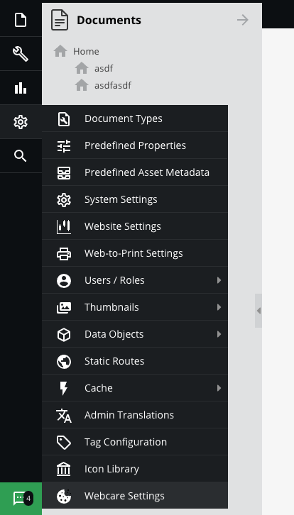
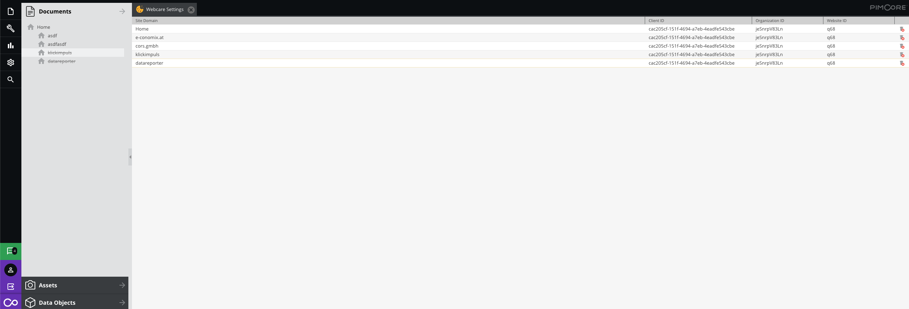

CORS WebCare Bundle
--------

WebCare - DataReporter Pimcore Integration (https://www.cookiebanner.at/)

# Installation

```bash
composer require cors/web-care

bin/console pimcore:bundle:enable CORSWebCareBundle
bin/console pimcore:bundle:install CORSWebCareBundle
```

# Configuration

 - Open Pimcore
 - Open Tools -> Webcare Settings 
 
 - Configure Client ID, Configuration ID and Website ID per Site or for your "Home" Site.
 

# Usage in Twig

This bundle provides several ways of integration. It comes with several twig functions:

- **cors_webcare_config** Load the corresponding instance of `CORS\Bundle\WebCareBundle\Entity\WebCareSite` based on the current site you are on. Returns null when no config is set.
- **cors_webcare_cookie_banner_css** Gives you the full path to Webcare's banner.css file
- **cors_webcare_cookie_banner_js** Gives you the full path to Webcare's banner.js file
- **cors_webcare_cookie_banner** Renders the banner.css and banner.js directly
- **cors_webcare_privacy_js** Gives you the full path to Webcare's privacystatement.js file
- **cors_webcare_privacy_js** Renders the privacystatement.js directly
- **cors_webcare_privacy_v2_js** Gives you the full path to Webcare's privacystatement_v2.js file
- **cors_webcare_privacy_v2** Renders the privacystatement_v2.js directly
- **cors_webcare_imprint_js** Gives you the full path to Webcare's imprint.js file
- **cors_webcare_imprint** Renders the cors_webcare_imprint_js.js directly
- **cors_webcare_imprint_v2_js** Gives you the full path to Webcare's imprint_v2.js file
- **cors_webcare_imprint_v2**: Renders the cors_webcare_imprint_v2.js directly
